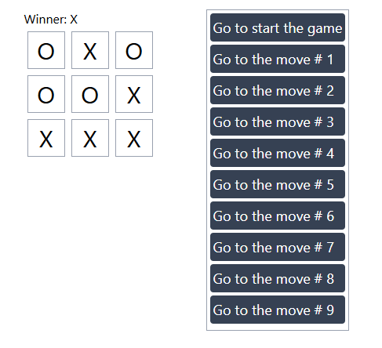

# ✅ Tasker - Simple Task Manager App (React.js)

**Tasker** is a basic yet powerful task management app built using **React.js** and **`useState` only**. This project demonstrates core React concepts like state management, lifting state up, conditional rendering, and working with modals — all in one clean and functional UI. 🧠⚛️

---

## 📸 Screenshot

---

## 🚀 Features

- ➕ **Add New Task**  
  Quickly add a new task using the modal form.

- ✏️ **Edit Task**  
  Reuse the same modal to edit existing tasks.

- ❌ **Delete Task**  
  Remove a task from the list.

- 🧹 **Delete All Tasks**  
  Instantly clear all tasks with a single click.

- 🔍 **Search Task**  
  Filter tasks by keywords in real time.

- 🧠 **Single Modal for Add & Edit**  
  Smart modal UI that switches between add and edit modes.

---

## 🛠️ Technologies Used

- ⚛️ **React.js**
- 🧠 **useState** (no external state management)
- 🧼 CSS / Tailwind / Minimal styling
- ✨ Functional components only

---

## 🧠 Key React Concepts

- `useState` for managing tasks, modal state, input fields, and search queries
- **State lifting** to pass data/functions between components
- **Conditional rendering** to toggle modal mode (Add / Edit)
- **Single modal** reused for both creating and editing tasks
- **Real-time search** through the task list

---

## 🎯 What I Learned

- Building CRUD functionality with useState
- Lifting state up between components
- Handling a single modal component in multiple modes
- Creating a responsive and interactive UI with pure React

---

## 🧹 Future Improvements

- Save tasks in localStorage
- Add due date or priority
- Dark mode toggle
- Mobile responsive design
- Task completion toggle
